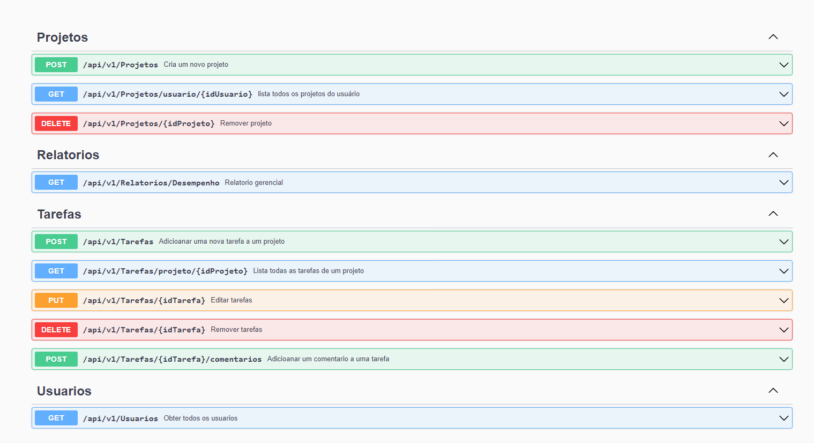

# Desafio Técnico Eclipse Works
Esta é a solução para o desafio apresentado pela empresa Eclipse Works.

O desafio é constituido em:
* fase 1 - Desenvolvimento da solução proposta;
* fase 2 - Simulação da interação com o PO visando refinamento para futuras implementações ou melhorias;
* fase 3 - Sugestões técnicas para evolução da aplicação.

## Fase 1 - Desenvolvimento da solução

Como resposta ao desafio foi desenvolvida uma API que permite os usuarios organizar e monitorar suas tarefas diarias.
A API é composta por End-points que permitem a gestão de projeto, tarefas e emissão de relatórios.<br>



### Padrões e arquitetura
A arquitetura hexagonal foi escolhida para guiar o desenvolvimento da aplicação somado aos preceitos do Clean Code, SOLID e boas pratícas da comunidade.
A comunicação entre as camadas se dá através de interfaces e injeção de dependência. Foi a adotado a estratégia de middleware para tratar as execeções de maneira global
dando o devido retorno para cada tipo diferente de exception.<BR>
Para atender o requisito de apenas pertimir a execução do relatorio para usuários com função especifica de gerente, foi adotado a estratégia de Filter, assim interceptando a requisição 
e fazendo a validação necessária antes da mesma chegar ao controller.<br>

A aplicação é constituida por cinco camadas, cada uma com sua responsabilidade definida:
* *API* - É a camada que expõe endpoints HTTP para comunicação externa, sendo a camada mais alto nivel;
* *Application* - É a camada responsável pela orquestração as operações de negócio, fazendo a ponte entre a camada de API e o domínio;
* *Domain* - Contém a lógica de negócio, entidades, e regras essenciais da aplicação;
* *Infra* - Responsável pela implementação de acesso a dados, incluindo repositórios e configurações do Entity. Também é responsável pelo mapeamento de IoC;
* *Tests* - Contém os testes unitários para garantir a qualidade e o funcionamento correto das regras de negócio.<br> 
Em virtude do tempo proposto foram feitos apenas os testes do Dominio. 

### frameworks, libs e tecnologias
O projeto foi desenvolvido utilizando o .net na versão 8, rodando no Docker e persistindo os dados no SqlServer.<br>

Essas Foram as principais bibliotecas adotdas:
* *EntityFrameworkCore* - É o ORM da aplicação, auxiliando na persistência dos dados;
* *Asp.Versioning* - Utilizado para versionamento da API;
* *Swashbuckle.AspNetCore* - Permite enriquecer a documentação da api via swagger;
* *Microsoft.DependencyInjection* - Utilizado para a injeção de dependência;
* *Bogus* - Utilizado para criar as fabricas de Fakes nos testes de unidade.
* *FluentAssertions* - Usado para efetuar as validações dos testes de unidade.
* *Moq* -> Utilizado para mockar o comportamento de classes externas nos testes de unidade.
* *xunit* -> Foi o framework de teste adotado no projeto.

### Executar
O projeto está configurado para rodar no docker juntamente com uma instancia do bando de dados SqlServer. Caso seja necessário rodar local basta inserir as credenciais do BD no appsettings<br>
<br>

Na raiz do projeto rode o comanando a seguir:<br>

``` docker-compose up --build ```

Ao Final da execução basta acessar http://localhost:5000/swagger/index.html <br>
Quando a aplicação faz a execução dos Migrations na base dados é inserido dois usuarios no BD. Esses usuários podem ser utilizados para os testes.<br>
Através do endpoint GET - Usuários é possível obter as informações desses usuários previamente cadastrados.

``` 
  {
      "id": "e563980d-9743-4b27-bd9d-3c98c5a731c7",
      "nome": "usuario comum",
      "perfil": "Usuario"
    },
    {
      "id": "e32d41d4-5d3b-4b19-a3ec-df8a275058a7",
      "nome": "usuario gerente",
      "perfil": "Gerente"
    }
 ```
## Fase 2 - Refinamento
O objetivo dessa etapa é trazer questionamentos e ideias para discussão com o PO e o time, para evoluir e melhorar o produto nas proximas sprints.

* Nessa primeira etapa entendo que seja um MVP, mas acredito que seria interessante termos mais claramente a definição de quais são os campos obrigatórios como também suas limitações, por exemplo: Limite de caracteres e  limite de data (passado e futuro).
* asfas

